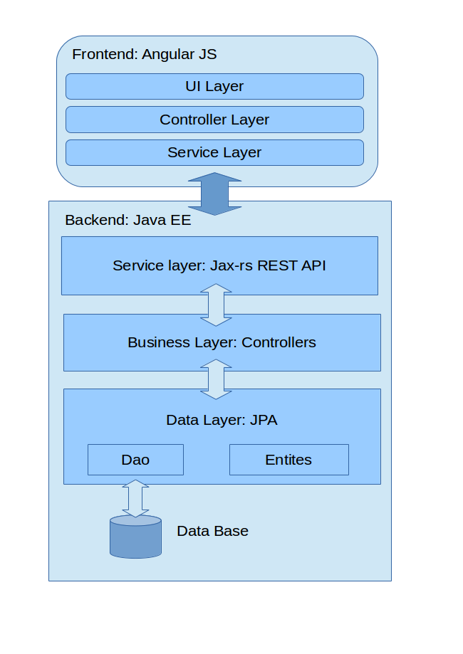

# Angular JavaEE Rest Test application

This is an example 3-tier application (front-end, back-end and data layer) build in top of angular with bootstrap in the front-end and javaee tomee web application runing in the server.

The application contains a CRUD view to create, list, edit and delete contacts. Contacts has got 5 fields: First Name, Last Name, Email, Date of Birth and Address.

## Application structure

The application is developed using various tecnologies:

- Angular js: the logic and the UI of the front-end application.
- Bootstrap: a set of css an javascript libraries that helps the app looks good.
- UI Bootstrap: set of preconfigured widgets to use in frontend. This provide the datepicker and pagination components.
- Java EE: JAX-RS and JPA application in the backend to serve the REST API.
- Postgresql: A database to store the data

### Layer architecture

This test application is an example of modern web layered architecture. Application is divided on frontend and backend communicated across RESTFULL API. As we said before, the frontend is developed on Angular JS framework, while backend is developed using Java EE tecnologies. Next picture shows the layers and parts of both application sides.

### Backend API

Backend service has a simple API to manage Contacts (create, update, remove and list). The API specification is included as a YAML file that follows the Swagger Specification. You can find it in doc/ folder of the project. A Swagger generated documentation in static html file is included in doc/ folder too.

## Compile and run the app

To compile the application we need to run 'grunt build' in the client-ajrtest folder. This result in a new 'dist' folder inside. Then we must run 'mvn package' on the server-ajrtest folder to produce the war. By last, we need to have a postgres database (script to create it is supplied in sql folder) and a Java EE application server to host the war. I have tested it in Apache Tomee server.

## Using the app

The application is trivial to use. In the main page you can see a list of contacts, each one can be edited or deleted with buttons on the right. There is a button to create new contact too. Delete contact shows a confirm dialog previusly. Edit contact opens an inline form just below the contact row. On the contact edit / create form, the save button is disabled until form is valid.
